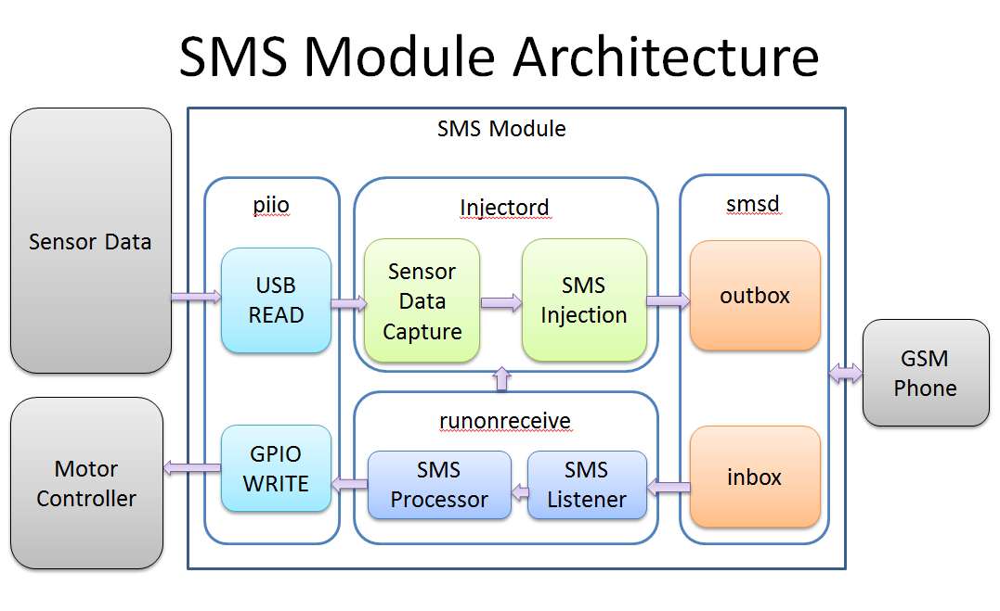
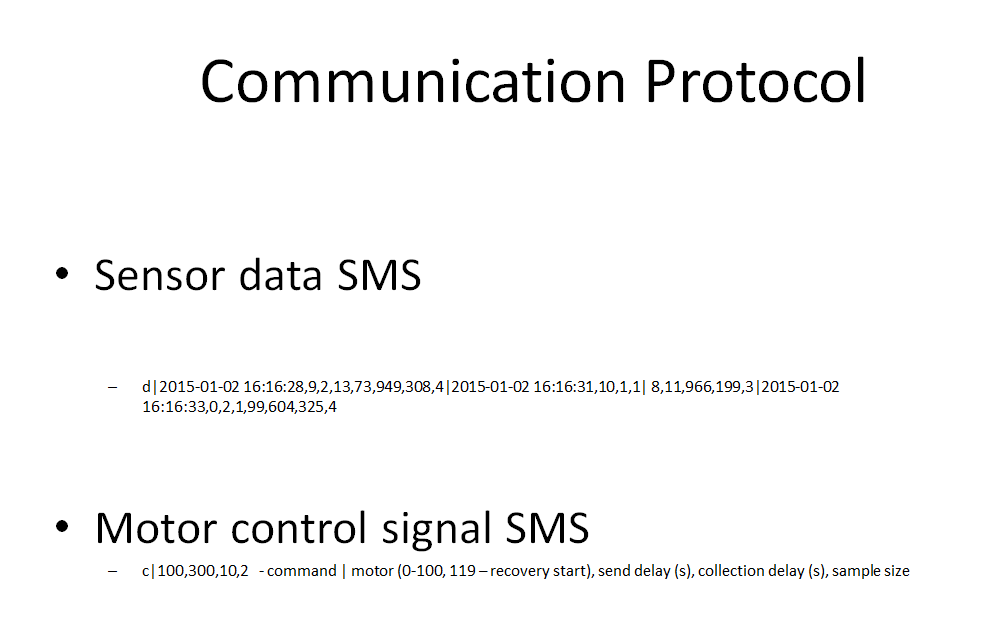

#SMS Controller for RaspberryPi
This project shows the use of RaspberryPi computer to build a control system using short messages based protocol over a GSM network. Although this was originally built for RaspberryPi this software is possible to deploy on any Linux based Operating system.

#Installation

#Architecture

